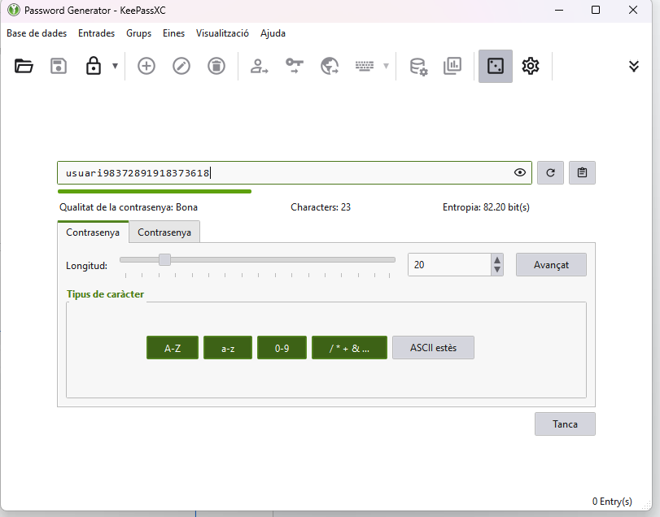

# Guia d'Ús Tècnica (Manual Operatiu)

# Guia d'Ús Tècnica – KeePassXC Portable

Aquesta guia explica pas a pas com utilitzar KeePassXC Portable per gestionar contrasenyes de manera segura dins l’equip tècnic.

---
## 1. IMATGES DEL PROCEDIMENT I DESPRES EXPLICACIÓ PAS A PAS COM HO HE FET

## 1. Instal·lació i Configuració Inicial de la base

### Descàrrega i ús portable

1. Accededir a la pàgina oficial portable que he utlitzat
3. Descarrega la versió **Portable** segons windows en el meu cas.
4. Descomprimeix el fitxer zip en una carpeta segura o a descarregues en el que he fet jo per exemple.

### Crear una nova base de dades

Quan obres KeePassXC Portable per primer cop, veuràs una pantalla inicial

1. Fes clic a Create Database.
2. Introdueix un nom i una descripció per a la base de dades.
3. Posa contrasenya segura.
4. Desa la base de dades com a fitxer kdbx en una ubicació segura.

## 2. Generació de Contrasenyes Segures

1. Obre la base de dades i crea una entrada nova .
2. Fes clic a la icona de clau per obrir el generador de contrasenyes.
3. I crear contrasenya segura amb molts digits i caracters
4. Clica Generar i copia la contrasenya generada.
5. Desa l’entrada amb el nom del servei i l’usuari.

## 3. Exemples d'Ús i Emplenament Automàtic

### Desar un correu electrònic

1. Crea una entrada amb el nom "Gmail", per exemple.
2. Omple els camps:
   Nom d’usuari posa
   Contrasenya una
   URL el que sigui
3. Desa l’entrada.

### Desar una credencial d’un servei web o aplicació

Segueix els mateixos passos que a dalt, canviant el nom i l’URL pel servei concret

## 4. Gestió de Còpies de Seguretat (Backup)

### Fer una còpia de seguretat del fitxer .kdbx

1. Tanca KeePassXC.
2. Copia el fitxer .kdbx a un lloc segur:
USB el meu personal

### Recomanacions que desitjo al fer tot el procediment

- No comparteixis mai el fitxer .kdbx sense contrasenya mestra.
- Fes còpies setmanals.
- Desa sempre la còpia en un lloc diferent del fitxer original.

