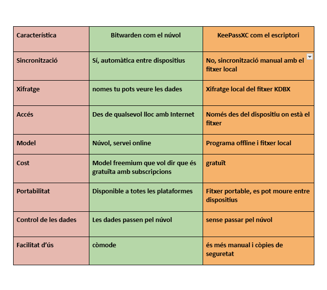

## Informe: Anàlisi i Justificació de l’Ús d’un Gestor de Contrasenyes

## 1. Introducció i Justificació

Les contrasenyes fàcils o repetides són un risc molt gran per a l’empresa. Els hackers utilitzen atacs com per exemple

- **Atac de diccionari:** Proben moltes paraules comunes per endevinar contrasenyes.
- **Credential stuffing:** Proben contrasenyes robades d’altres llocs per accedir als comptes.

Si això passa, poden entrar als sistemes i robar informació important.

Per això és important usar un **gestor de contrasenyes**. Aquestes eines creen contrasenyes fortes, les guarden i no has d’estar pendents de recordar-les totes. Així evitem posar contrasenyes fàcils o repetir-les.

## 2. Comparativa Tècnica

## 3. Avantatges i Inconvenients

### Bitwarden https://bitwarden.com/download/

### Bitwarden  
🔗 [https://bitwarden.com/download/](https://bitwarden.com/download/)

**Avantatges:**  
- Codi obert i amb xifratge de punta a punta, cosa que garanteix alta seguretat.  
- Inclou funcions avançades com notes segures, generador de contrasenyes, autocompletat i emmagatzematge de documents i dades de pagament.  
- Compatible amb diversos sistemes operatius i navegadors, i permet iniciar sessió amb dades biomètriques.  

**Inconvenients:**  
- Depèn del núvol per sincronitzar dades, reduint el control total de l’usuari sobre on s’emmagatzemen les contrasenyes.  
- Requereix connexió a Internet per aprofitar totes les funcions.  

---

### KeePassXC  
🔗 [https://keepassxc.org/](https://keepassxc.org/)

Avantatges:  
- Eina lleugera, ràpida i fàcil de configurar, ideal per a usuaris que prefereixen control manual.  
- Funciona completament sense connexió a Internet, mantenint les contrasenyes en local i millorant la privadesa.  
- Permet gestionar múltiples bases de dades i personalitzar la seguretat segons les necessitats.  

Inconvenients:  
- Compartir contrasenyes entre diversos usuaris pot ser més complicat.  
- No té integració automàtica amb el núvol ni sincronització entre dispositius per defecte.  

---

## 4. Recomanació

Recomano KeePassXC perquè ofereix més seguretat en mantenir les contrasenyes fora del núvol i permet un control total de les dades, tot i que requereix una gestió manual, és ideal per a entorns tècnics que prioritzin la privadesa i la protecció.

