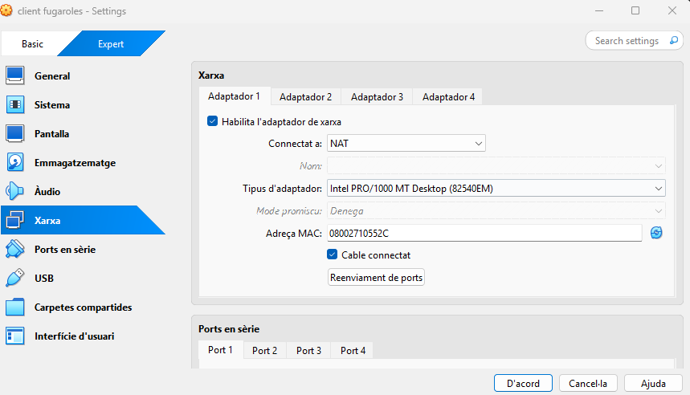
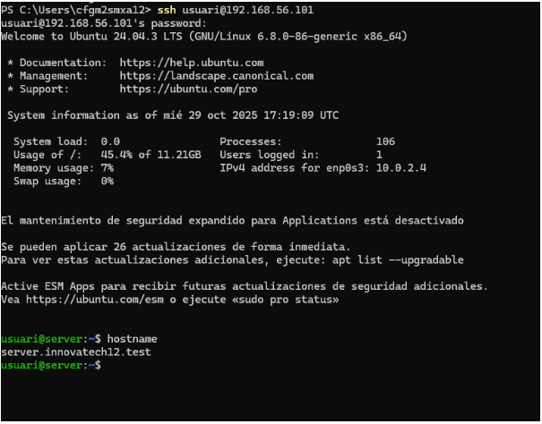

# Requeriments d'Infraestructura Inicial

Aquest document descriu els requeriments inicials d’infraestructura.  
Primer es mostren les captures de pantalla, i a continuació s’ofereix una explicació detallada de cadascuna, en format guia.

---

## Captures de pantalla

### Captura 1 – [Configuració de la màquina Server]

### Captura 2 – [Interfície de Xarxa Pública]

### Captura 3 – [Interfície de Xarxa Privada]

### Captura 4 – [Comprovació ssh amb maquina fisica]

---

## Guia explicativa

### 1. [Configuració de la màquina Server]
Explicació detallada del que mostra la imatge:  
- Quin component o configuració es veu.  
- Quin propòsit té dins la infraestructura.  
- Passos per reproduir-ho o configurar-ho.

### 2. [Interfície de Xarxa Pública]
Explicació detallada com abans.

### 3. [Interfície de Xarxa Privada]
Posarem la xarxa en nomes anfitrio per poder conectar una maquina virtual a la fisica

### 4. [Comprovació ssh amb maquina fisica]
---

## ✅ Resum Final

- Llista dels requeriments identificats.  
- Configuracions bàsiques necessàries.  
- Consideracions addicionals o pròxims passos.
