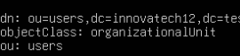

3. Tasques d'Implementació i Configuració del Servidor LDAP
   La Consultora EverPia ha de complir estrictament amb les següents tasques d'instal·lació i configuració:
   
3.1. Instal·lació i Configuració Base d'OpenLDAP

## Captures de pantalla

### Captura 1 – [Instal·lació del servei OpenLDAP]

### Captura 2 – [Configuració de la base de dades]

### Captura 3 – [Configuració de la contrasenya d'administrador]

### Captura 5 – [Creació d'Unitats Organitzatives (OU) inicials.]

### Captura 5 – [Validació de les Unitats Organitzatives]

