   
## 3.1. Instal·lació i Configuració Base d'OpenLDAP

## Captures de pantalla

### Captura 1 – [Instal·lació del servei OpenLDAP]
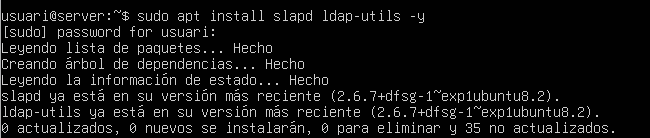

### Captura 2 – [Configuració de la base de dades]
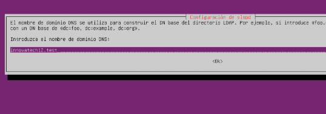

### Captura 3 – [Configuració de la contrasenya d'administrador]
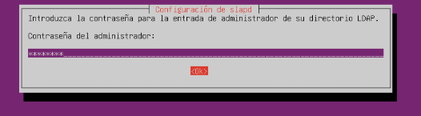

### Captura 4 – [Creació d'Unitats Organitzatives (OU) inicials.]

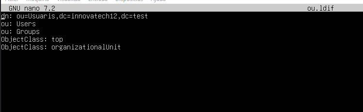

### Captura 5 – [Validació de les Unitats Organitzatives]
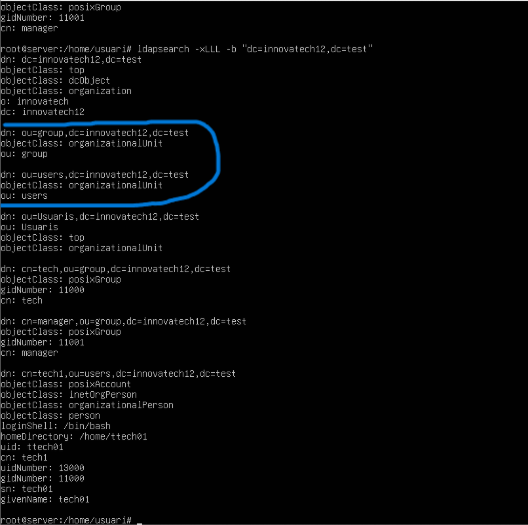

## 3.2. Gestió i Administració (LAM)

### Captura 6 – [Instal·lació del Gestor d'Usuaris LDAP (LAM)]
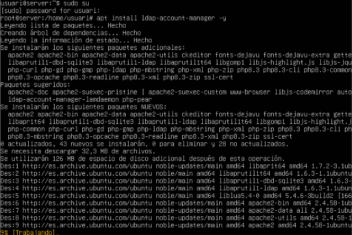

### Captura 7 – [Accés Remot i Configuració.]
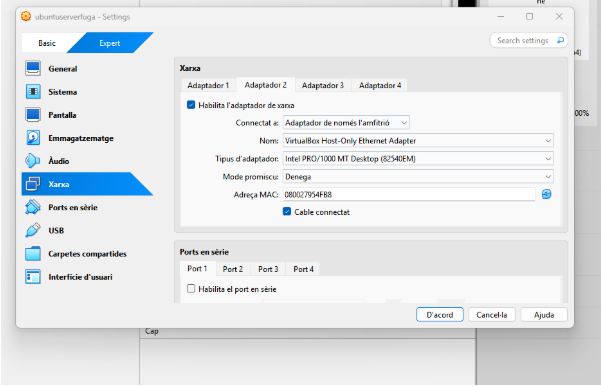

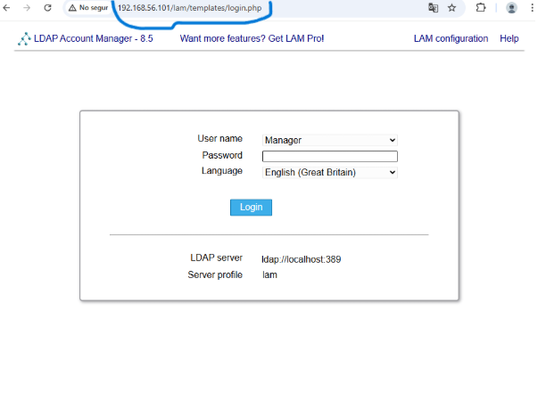

### Captura 8 – [Configuració per defecte]
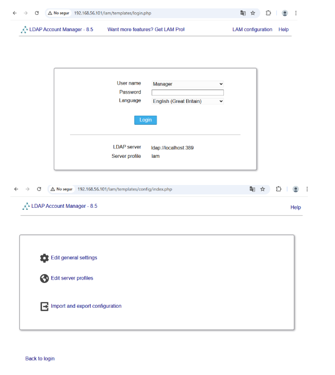

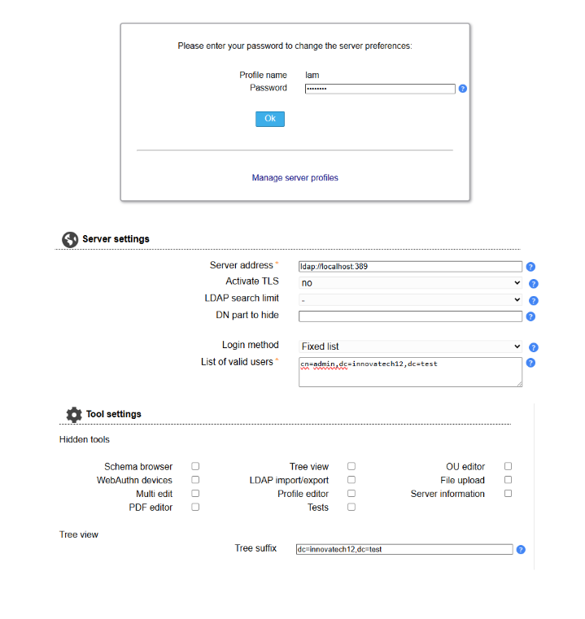

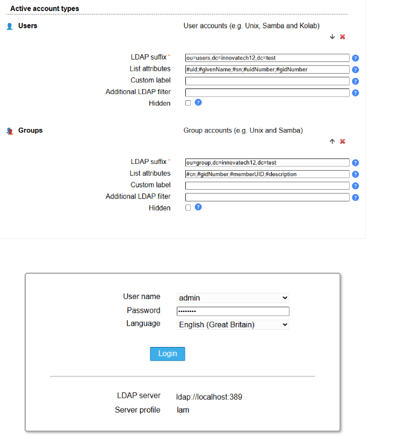

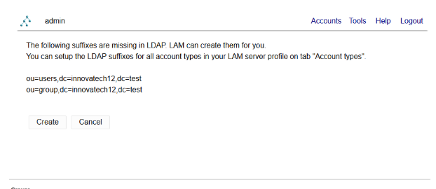

### Captura 9 – [Creació de Grups.]
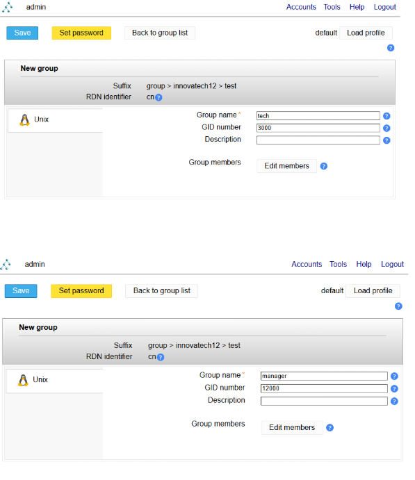

### Captura 10 – [Creació d'Usuaris de Prova]
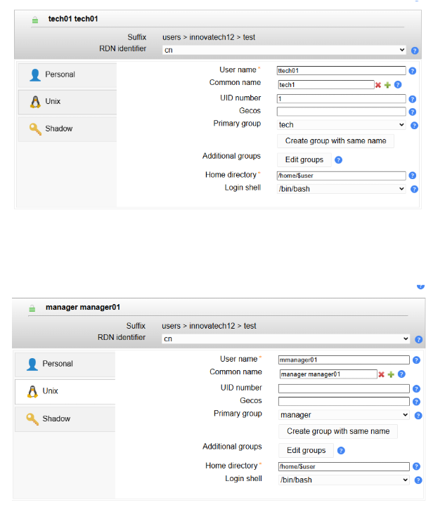

## Guia explicativa

## 3.1. Instal·lació i Configuració Base d'OpenLDAP

### 1. [Instal·lació del servei OpenLDAP]

### 2. [Configuració de la base de dades]

### 3. [Configuració de la contrasenya d'administrador]

### 4. [Creació d'Unitats Organitzatives (OU) inicials.]

### 5. [Validació de les Unitats Organitzatives]

## ✅ Resum Final

## 3.2. Gestió i Administració (LAM)

### 6. [Instal·lació del Gestor d'Usuaris LDAP (LAM)]

### 7. [Accés Remot i Configuració]

### 8. [Configuració per defecte]

### 9. [Creació de Grups]

### 10. [Creació d'Usuaris de Prova]

