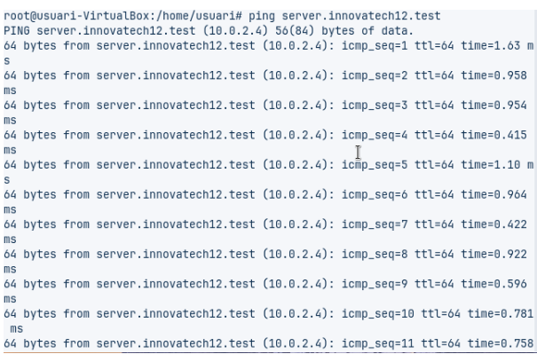
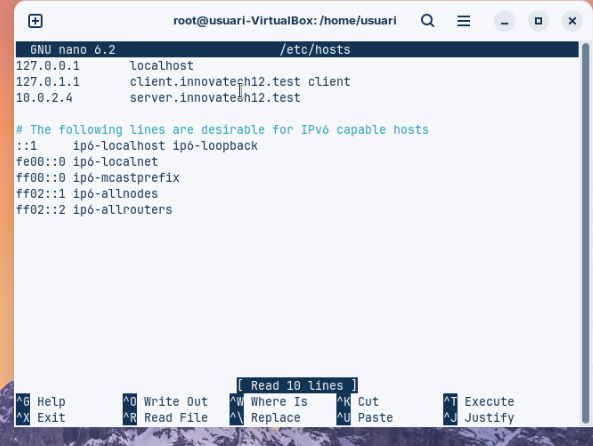
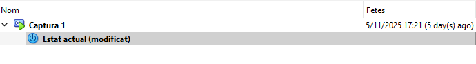
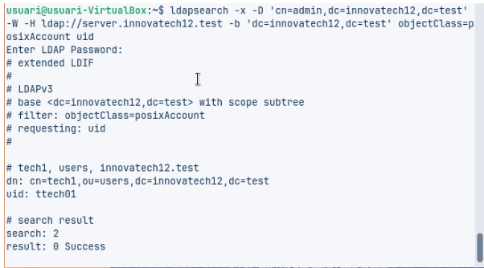
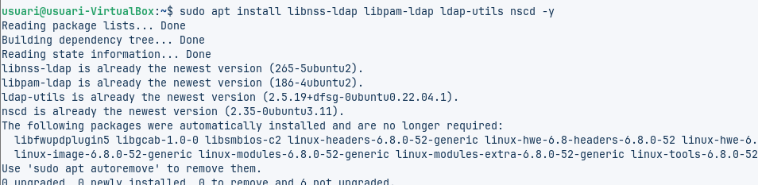
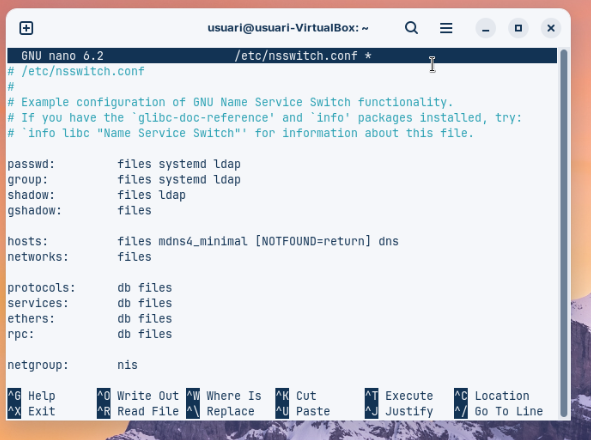
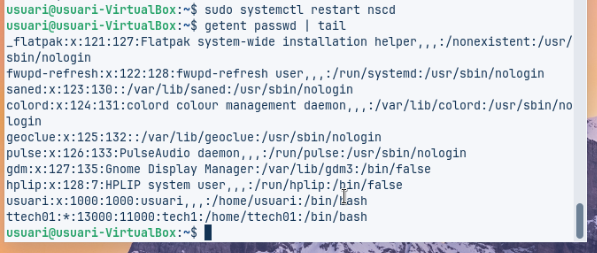
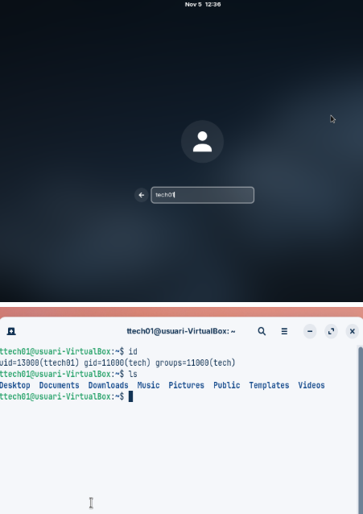

# Integració de Client

Aquest document descriu la configuracio del servidor amb el client.  
Primer es mostren les captures de pantalla, i a continuació s’ofereix una explicació detallada de cadascuna, en format guia.

---

## Captures de pantalla

### Captura 1 – [Instal·lació del Client.]

### Captura 2 – [Resolució de Noms.]

### Captura 3 – [Validació de la Connectivitat LDAP]

### Captura 4 – [Mòduls d'Autenticació.]

### Captura 5 – [Configuració del Client.]

### Captura 6 – [Comprovació del Sistema.]

### Captura 7 – [Prova d'Accés Final.]

---

## Guia explicativa

### 1. [Instal·lació del Client]
Explicació detallada del que mostra la imatge:  a la primera captura el que volem fer es canviar el nom del servidor en el nostre cas hem de editar-ho amb hostname i posar el innovatechXX.test en el cas XX es el numero de llista

### 2. [Interfície de Xarxa Pública]
Posem la xarxa nat per poder instalar paquets i que ens vagi.

### 3. [Interfície de Xarxa Privada]
Posarem la xarxa en nomes anfitrio per poder conectar una maquina virtual a la fisica directament i en el nostre cas tenim comprovació de que va amb el ssh desde la fisica

## ✅ Resum Final
basicament aquest primer apartat hem configurat el servidor de ldap amb les xarxes que toquen i amb el nom del servidor

