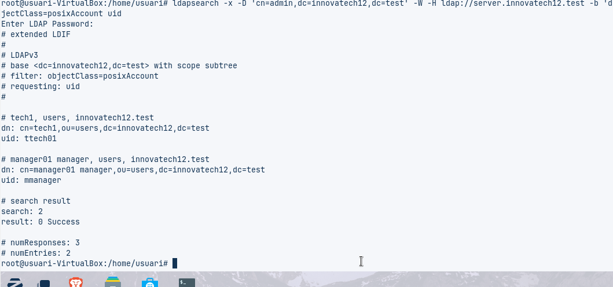
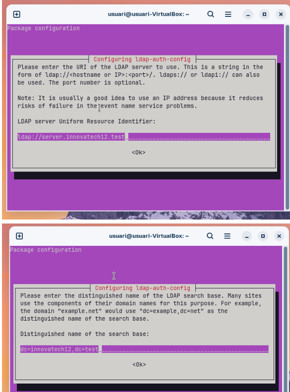
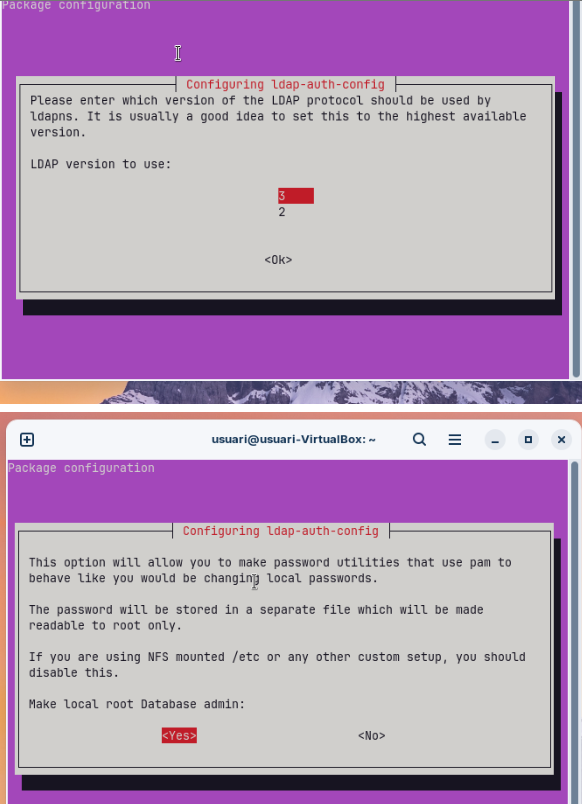
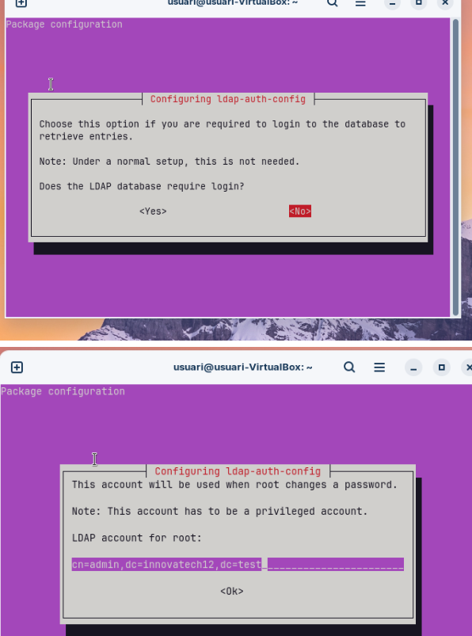
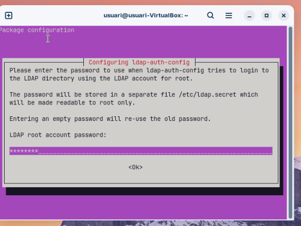
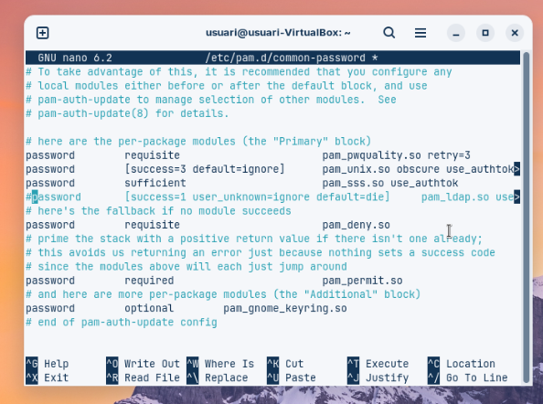
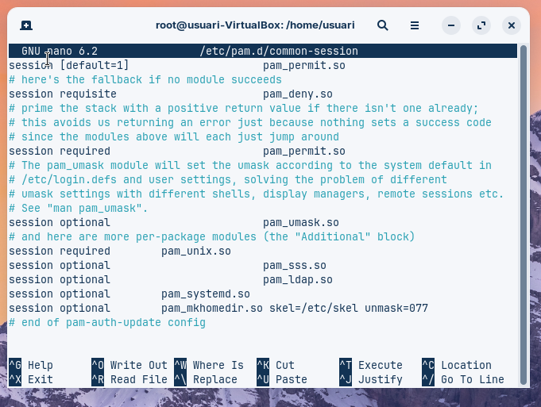

# Integració de Client

Aquest document descriu la configuracio del servidor amb el client.  
Primer es mostren les captures de pantalla, i a continuació s’ofereix una explicació detallada de cadascuna, en format guia.

---

## Captures de pantalla

### Captura 1 – [Instal·lació del Client.]

### Captura 2 – [Resolució de Noms.]

### Captura 3 – [Validació de la Connectivitat LDAP]

### Captura 4 – [Mòduls d'Autenticació.]

### Captura 5 – [Configuració del Client.]

### Captura 6 – [Comprovació del Sistema.]

### Captura 7 – [Prova d'Accés Final.]

---

## Guia explicativa

### 1. [Instal·lació del Client]
Instal·lar un client Ubuntu Desktop i configurar la interfície de xarxa per comunicar-se amb el servidor (Host-Only)

### 2. [Resolució de Noms]
Configurar l'arxiu d'hosts del client per resoldre l'adreça IP del servidor a server.innovatechXX.test. S'ha de proporcionar una instantània (snapshot) de la màquina client un cop fet el canvi.

### 3. [Validació de la Connectivitat LDAP]]
Comprovar la connectivitat amb el servidor fent una consulta ldapsearch des del client

### 4. [Mòduls d'Autenticació]
Instal·lar els mòduls necessaris per permetre l'autenticació amb LDAP.

### 5. [Configuració del Client]
Modificar els arxius de configuració del client necessaris. S'han de mostrar clarament els canvis realitzats en el codi dels arxius

### 6. [Comprovació del Sistema]
Reiniciar els serveis i verificar amb la comanda getent passwd que els usuaris del directori són visibles localment.

### 7. [Prova d'Accés Final]
Reiniciar el client i iniciar sessió amb l'usuari tech01. Es requereix una captura de pantalla que demostri l'accés correcte i la creació automàtica de la carpeta personal de l'usuari.

## Resum Final
Aqui voliem conectar el client amb el servidor, per tal de tenir tota la informació de ldap en el cient de zorin per tal de que es vegi tot alla i finalment puguis configurar el teu usuari de tech1 al client i poder crear una carpeta personal automatica amb el ID veure que esta tot correcte

