# Diagnosi Avançada amb DIG i NSLOOKUP
### Linux / macOS  MARC JURADO 2N SMX

---

## Descripció del Projecte
Pràctica de diagnosi avançada de DNS utilitzant les eines DIG i NSLOOKUP per analitzar registres, servidors de noms, consultes autoritatives i mes

---
## Introduccio i coses a saber abans de començar
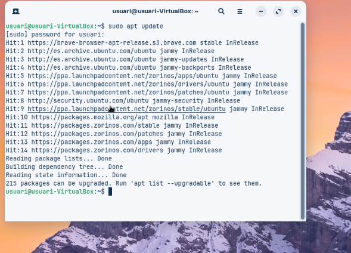

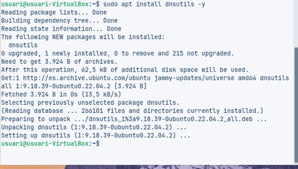

#### Que em de fer:
principalment per començar hem de fer un apt update per actualitzar i seguidament instalar el dig en aquest cas dnsutils -y I JA PODEM COMENÇAR

---

## A. Diagnosi Avançada amb DIG

### Consulta Bàsica de Registre A

#### Captura:
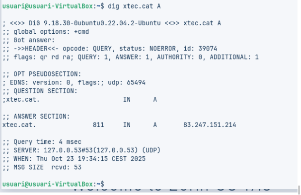

#### Explicació
xtec.cat és el domini que es consulta.  es la 83.247.151.214
El tipus de registre és A, que retorna la seva adreça IP que ens dona.

#### Has d’identificar:
IP de resposta: que es la ip del domini de xtec.cat 
TTL: 3600 segons  és el temps que el registre es guarda en memòria cau.  
Servidor que ha respost: el que surt després de SERVER, en aquest cas 8.8.8.8.

---

### Consulta de Servidors de Noms (NS)

#### Captura:
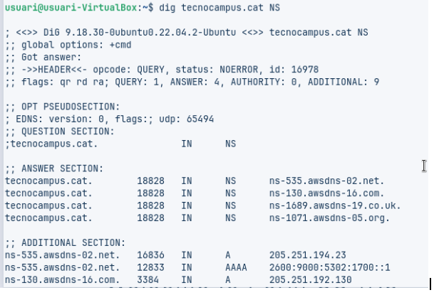
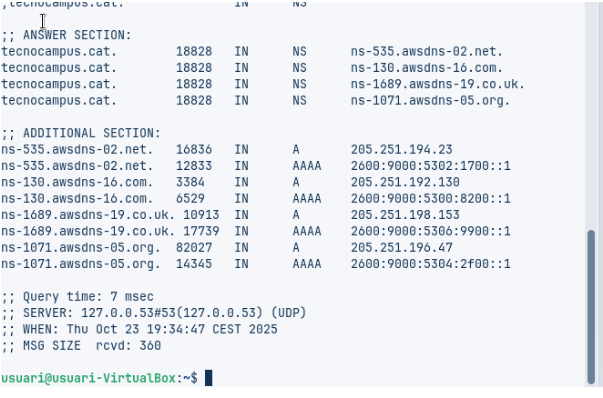

#### Explicació
Aquesta consulta mostra quins són els servidors de noms autoritatius per al domini tecnocampus.cat.  
Permet identificar quins servidors contenen la informació DNS original del domini.

#### Anàlisi
Els servidors de noms autoritatius del domini tecnocampus.cat que són 
ns1.tecnocampus.cat  i ns2.tecnocampus.cat

El TTL dels registres NS indica quant de temps poden estar en memòria.  

---

### Consulta Detallada SOA

#### Captura:
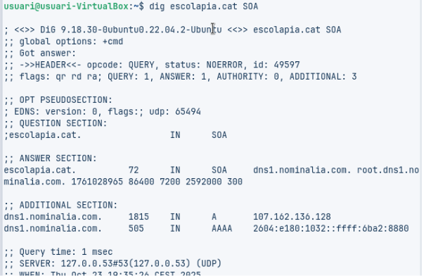

#### Explicació
El registre SOA ens ensenya el servidor DNS principal del domini i tamnbe te dades administratives importants, com el correu de contacte i el número de sèrie.

#### Anàlisi 
Aquest registre indica la configuració de sincronització dels servidors secundaris i la caducitat de les dades DNS amb el correu administrador i més registres de SOA

---

### Consulta de Resolució Inversa

#### Captura:
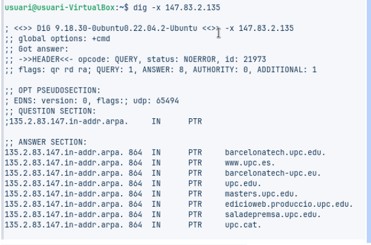
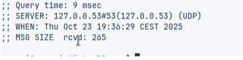

#### Explicació
La resolució inversa t'ajuda a obtenir el nom de domini que va amb la adreça ip.

#### Anàlisi
La IP  correspon al nom de domini
El resultat confirma que la resolució inversa està configurada be i que la IP pertany a la xarxa que toca.  

---

## Comprovació de Resolució amb NSLOOKUP

L’eina NSLOOKUP permet fer consultes DNS

---

### Consulta Bàsica no Autoritativa

#### Captura:
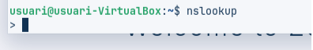

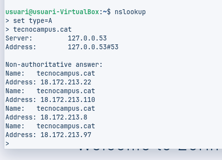
#### Anàlisi:

#### Explicació
La consulta es realitza amb nslookup amb el registre A i demanant la IP del domini en el nostre cas tecnocampus.cat.  
Si la resposta no ve d’un servidor de noms autoritatiu, es veu com no autoritativa.

#### Anàlisi
Servidor DNS utilitzat: 8.8.8.8 que es la publica
Resposta no autoritativa: la informació ve d’un servidor, no del servidor autoritatiu del domini.  
IP retornada la del principi

---

### Consultes Autoritatives

#### Captura:
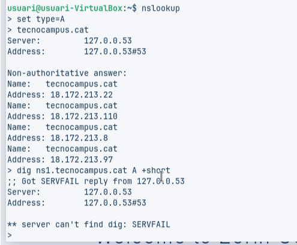

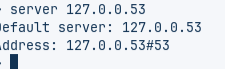

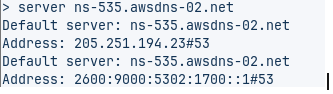

#### Anàlisi:

#### Explicació
Aquesta consulta es fa nslookup directament a un servidor de noms autoritatiu per tenir una resposta directa del domini.

#### Anàlisi
Servidor utilitzat el de tecnocampus
Resposta autoritativa: el camp authoritative answer confirma que la informació qie ve directament del servidor del domini.  
IP retornada la mateix del servidor que volem la de abans.  

---
### Resolucions locals

Farem un ping al server, aixo permet comprovar el funcionament útil per entorns de xarxa local on no es disposa de servidor de noms propi i que evita haver d’accedir a equips o recursos per la seva IP.

